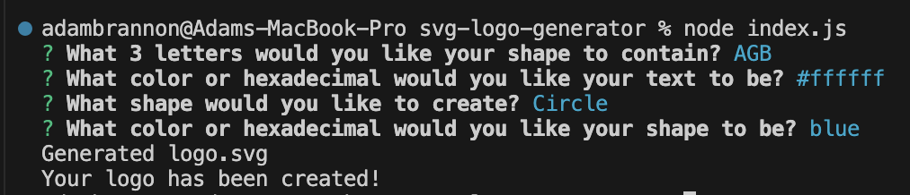

# SVG Logo Creator

Welcome to the SVG Logo Creator App! This user-friendly Node application is designed to create an SVG logo file based on prompts in the CLI.

## Installation

To install this application, please follow the below instructions:
- Pull the repository files to your local machine
- Open the repository in your code editor of choice
- Open the terminal and run the command `npm i` to install the required dependencies

## Usage

- Inside the terminal run the command `node index.js` to start the application
- Follow the prompts to enter the required information
- Once complete, an SVG Logo file will be generated!

## Demo
- [Check Out the Video Demo!](https://drive.google.com/file/d/1iGsHd59jWUg5Lo8-9iMhl2ImJ4hxOLU3/view)

## Contributors
Adam Brannon

[Check out my repo](https://github.com/adam-brannon09)

[Email Me](mailto:adam.brannon09@icloud.com)

## Feedback and Support

If you encounter any issues while using the SVG Logo Creator or have any suggestions for improvement, please [open an issue](https://github.com/adam-brannon09/readme_generator/issues) on the GitHub repository. I appreciate your feedback and will address any concerns as soon as possible.

## License

SVG Logo Creator is released under the [MIT License](https://opensource.org/licenses/MIT). You are free to use, modify, and distribute this application as per the terms of this license.

    

